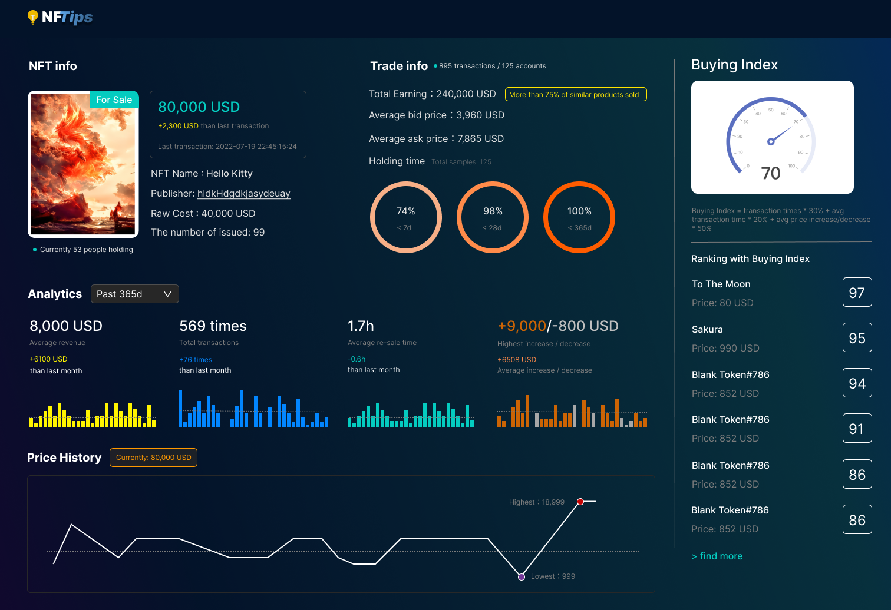

# NFTips - RFC

## 团队名称：莫慌！有我！

> 作者：
> - Joyven
> - Again
> - [Vita](https://github.com/ChenlingLu)
> - 养只小猪🐷

## 项目介绍
本项目将使用区块链公链数据对 NFT 数字藏品的“一生”做可视化分析，支持通过图片/ NFT 名称/ NFT 类别名称来溯源并分析藏品的交易情况（发行价、发行量，发行方，转手次数，转手时间，价格趋势等）。也支持用户的交易偏好分析，为 NFT 玩家闯荡数字藏品世界提供贴心 Tips 💡。

## 背景&动机
### 背景
> 参考论文：基于区块链技术的电子产品溯源方案设计_孙惠芳 https://www.doc88.com/p-90529281641973.html

随着人们对于数字藏品的投资/收藏需求不断增长，数字藏品的发布金额交易越来越频繁，并且由于网络交易的虚拟性，使数字藏品的交易双方无法取得信任度，造成某些卖家虚假发布、哄抬价格等情况，使投资者对于数字藏品的价值判断造成误判，增加了投资风险。数字藏品的交易情况都发生在虚拟世界，涉及发布、转手、买入、卖出等一系列复杂环节，无法使其的溯源得到充分的保证。而区块链自身的信息具有去中心化、不可逆地篡改、可追溯、开放性等功能，使这一过程都变得有序可查，因此我们认为使用区块链数据源能够为分析结果提供公正、准确，具有公信力的数据基础。

### 当前现状：
1. 区块链行业成为投资者的热门选择，很多人尝试在这一领域进行探索，对于可靠的，直观的行业信息有市场需求。
2. 在国内，区块链相关的分析产品功能比较单一，大部分使用文本形式来展示，缺乏图形化的叙述的方式。
3. 市面上的一些类似产品无法根据名称/图片进行搜索具体的藏品（一般只能根据地址/交易哈希/区块高度来进行查询）。
4. 由于区块链知识有一定门槛，导致部分入门用户很难在短时间内了解行业玩法、判断数字藏品的价值，以及规避投资风险。
5. 在真实的市场环境中，出于获利的目的，卖家可能存在藏品发行量作假行为，但是买家无法得知真实情况，影响买家对藏品价值的判断。
6. 当前藏品在二级市场的流通信息无法直接被获取，导致买家无法对交易进行预测分析。

根据以上一些背景和原因，我们想要发布一款能解决以上问题的数字藏品溯源工具 - NFTips。用户在使用这款产品后，能够有效地判断数字藏品的真实价值，获得投资洞察，有效规避投资风险。
具体设计以及功能见下文。

## 项目设计

我们计划主要使用 TiDB 的存储能力，查询能力（多维分析）来实现以下 🌟🌟🌟 功能：

#### 🌟🌟🌟功能一：支持通过图片/ NFT 名称/ NFT 类别名称来查询藏品情况（藏品溯源）
快速检索功能，用户可以使用 NFT 名称 / 类别来搜索，同时支持上传图片进行搜索。

#### 🌟🌟🌟功能二：通过可视化的界面展示单个藏品的发布-交易过程，给出购买 tips

Part 1 藏品基础信息
  1. 藏品名称
  2. 发行价
  3. 发行数量
  4. 藏品类别
  5. 发行方
  6. 当前是否在售
  7. 当前多少人持有该藏品

Part 2 交易数据分析
  1. 平均卖出价，高于/低于市场同类产品 x%
  2. 平均买入价，高于/低于市场同类产品 x%
  3. 转手次数，比上月 +/- x 次
  4. 持有时间（平均转手时间，24 小时内/ 7 天内/ 28 天内卖出）
  5. 累计收益，高于/低于市场同类产品 x%
  6. 历史最高涨跌幅

#### 🌟功能三：值得投资的藏品清单
将藏品的初始价格，当前价格，转手次数，转手用时的数据综合考虑（制定算法规则：价格涨最多，在相对短的时间里转手多次），进行降序排列，取前 10 个。

Part 1 整体投资价值得分参考（算法待优化）
投资指数 = 一年内转手次数 * 30% + 一年内平均转手时间 * 20% + 一年内涨跌幅 * 50%
  1. 转手次数按照交易次数计算，最多 30 分
  2. 平均转手时间，最多 20 分
  3. 涨价幅度，涨幅 < 5%，得 10 分；5% < x%< 10，得 20 分；10% < x%< 25%，得 30 分，25% < x%< 50%，得 40 分，50% < x%，得 50 分，最多 50 分
  4. 跌价幅度，跌幅 < 5%，扣 5 分；5% < x%< 10%，扣 10 分；10% < x%< 25%，扣 15 分，25% < x%< 50%，扣 20 分，50% < x%，扣 25 分，最多扣 25 分

Part 2 投资指数排行榜

#### 🌟功能四：卖家的藏品发布历史，发布偏好，收益情况，判断该卖家是否是值得关注的投资目标（二期）
通过单个藏品的 id 的第一笔交易情况，查出初始卖家。再使用卖家 id 查出他所卖出的所有藏品，进行分析：卖出的藏品类别占比，卖出的藏品均价，最高/低价藏品，正在流通中的藏品列表以及它们的初始价格和当前价格。

#### 🌟功能五：买家的交易历史，偏好，和购买趋势分析，判断他的购买方式是否值得借鉴（二期）
通过交易记录查出所有买家的 id， 再使用买家 id 查出他所有的买入记录，进行分析：买入的藏品类别占比，买入的藏品均价，买入的最高/低价藏品，正在流通中的藏品列表以及它们的初始价格和当前价格。

#### 功能六：实时交易预测（三期）

## 详细设计

后端部分：应用服务器去请求 nft 链，拿到数据然后进行数据解析，解析完成之后存储存储中心（TiDB Cloud） 。 使用 tidb 中的数据进行组装前端所需要的，返回给前端。
前端部分：通过 vue3 全家桶配合 Vercel 部署，数据可视化采用 echart 方案，接收后端数据并实时、定时、更新式渲染出来。
## 原型设计

